# esp32s3-lvgl-terminal.idf

基于 ESP32-S3 的 LVGL 多功能智能终端（ESP-IDF 版），集成 Wi-Fi 和亮度设置、串口终端、时间和天气显示、音乐播放、小智 AI 语音对话、小游戏等功能。

> **🔗 PS**：本工程是 [esp32s3-lvgl-terminal](https://github.com/Lee-Stone/esp32s3-lvgl-terminal) 的 ESP-IDF 版。

****

**⭐ 欢迎提出 Issues 和 PR，如果这个项目对你有帮助，请给个 Star！**

## 📑 目录

- [📖 项目简介](#-项目简介)
- [📁 项目结构](#-项目结构)
- [🛠️ 硬件配置](#️-硬件配置)
  - [1. 物料清单](#1-物料清单)
  - [2. 引脚映射](#2-引脚映射)
  - [3. 硬件实物](#3-硬件实物)
  - [4. 硬件原理图](#4-硬件原理图)
  - [5. 打板焊接](#5-打板焊接)
- [🔧 软件配置](#-软件配置)
  - [1. 安装 ESP-IDF](#1-安装-esp-idf)
  - [2. 克隆项目](#2-克隆项目)
  - [3. 配置开发环境](#3-配置开发环境)
  - [4. 编译项目](#4-编译项目)
  - [5. 烧录程序](#5-烧录程序)
  - [6. 免环境烧录](#6-免环境烧录)
- [⚠️ 注意事项](#️-注意事项)
- [📧 联系方式](#-联系方式)

## 📖 项目简介

这是一个基于 **ESP32-S3** 和 **LVGL** 图形库开发的多功能智能终端项目，采用 **ESP-IDF 架构**，通过友好的触摸屏界面，提供丰富的交互功能和便捷的设备管理。项目基于 FreeRTOS 多任务架构，支持高效的并发处理。

**主要功能：**

- ✅ **主界面**：实时显示时间、滚动文字、APP 入口等信息
- ✅ **设置**：支持屏幕亮度调节、Wi-Fi 扫描与连接配置
- ✅ **串口**：实时串口数据收发功能
- ✅ **天气**：显示实况天气和未来三天天气预报（心知天气 API）
- ✅ **音乐**：播放 SD 卡内的 MP3 音乐，支持音量调节
- ✅ **小智**：小智 AI 语音对话，虾哥开源的满血[小智](https://github.com/78/xiaozhi-esp32)（[xiaozhi.me](https://xiaozhi.me)）
- ✅ **游戏**：集成开源 LVGL 小游戏（2048、植物大战僵尸、消消乐、羊了个羊）
- ✅ **日历**：日历信息查看
- ✅ **电源管理**：使用 5V USB 或 4.2V 锂电池供电，接上锂电池时插入 USB 可边充边放

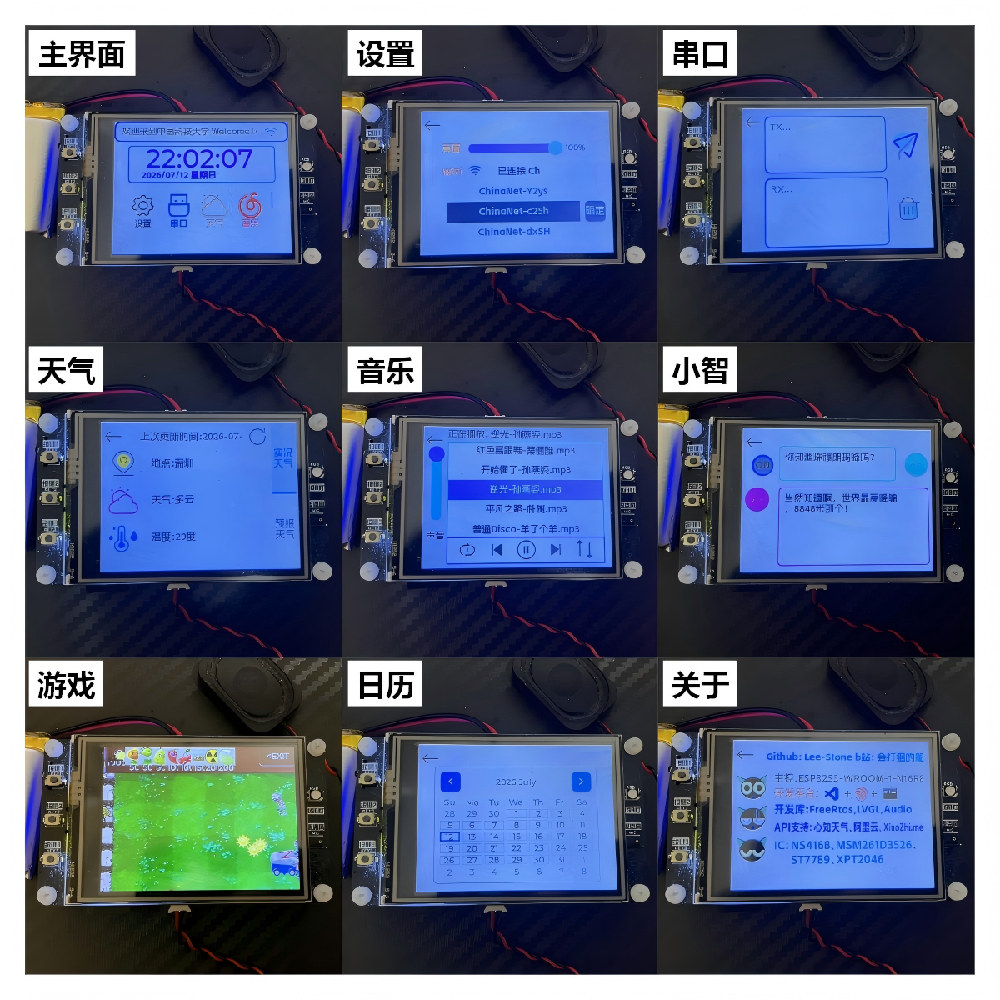**视频演示：**

- [LVGL+Freertos 开发基于 ESP32S3 的智能终端系统_哔哩哔哩](https://www.bilibili.com/video/BV1xu4m1c74M/)
- [LVGL 基于 ESP32S3 的智能终端 PLUS_哔哩哔哩](https://www.bilibili.com/video/BV1eXSuBkEo8/)

## 📁 项目结构

```
esp32s3-lvgl-terminal.idf/
├── main/                           # 主程序入口
│   ├── main.c                      # app_main() 入口，初始化各模块
│   ├── CMakeLists.txt              # 主组件构建配置
│   └── idf_component.yml           # 组件依赖声明
├── components/                     # 自定义组件（14 个）
│   ├── lcd_set/                    # LCD 显示驱动（ST7789）
│   ├── touch_set/                  # 触摸屏驱动（XPT2046）
│   ├── lvgl_set/                   # LVGL 初始化与适配
│   ├── ui_set/                     # LVGL UI 界面（屏幕、组件、图片、字体）
│   ├── task_set/                   # FreeRTOS 任务管理（核心调度模块）
│   ├── wifi_set/                   # Wi-Fi 扫描、连接与状态管理
│   ├── uart_set/                   # UART 串口通信
│   ├── data_set/                   # 数据获取（天气 API、HTTP 客户端）
│   ├── music_set/                  # SD 卡 MP3 音乐播放
│   ├── xiaozhi_set/                # AI 语音对话（小智）
│   ├── rgb_set/                    # RGB LED 控制
│   ├── adc_set/                    # ADC 电池电压检测
│   ├── key_set/                    # 按键输入检测
│   └── timer_set/                  # 硬件定时器
├── managed_components/             # 托管组件（自动下载）
├── partitions.csv                  # 自定义分区表（16MB Flash + OTA）
├── sdkconfig.defaults              # 默认 SDK 配置
├── dependencies.lock               # 依赖版本锁定文件
├── CMakeLists.txt                  # 顶层 CMake 配置
├── SquareLine_Project/             # SquareLine Studio 工程文件
├── hardware/                       # 硬件设计文件
│   ├── SCH_Schematic_*.pdf         # 原理图 PDF
│   ├── Gerber_PCB_*.zip            # PCB Gerber 文件
│   ├── BOM_PCB_*.xlsx              # BOM 采购清单
│   └── InteractiveBOM_PCB_*.html   # 交互式 BOM 焊接辅助
├── LICENSE                         # 开源协议
└── README.md                       # 项目说明
```
## 🛠️ 硬件配置

### 1. 物料清单

- **主控芯片**：【ESP32-S3 N16R8】16MB Flash + 8MB PSRAM
- **显示屏**：【ST7789】2.4 寸 SPI TFT 320×240
- **触摸屏**：【 XPT2046】SPI 电容触摸
- **音频输出**：【NS4168】I2S DAC 功放模块
- **麦克风**：【MSM261D3526H1CPM】I2S PDM 数字麦克风
- **存储卡**：【闪迪】Micro SD 卡
- **电源管理**：【TPS4056】单节锂电池充电、【RT9013】LDO 稳压
- **供电**：【5V USB】供电 或 【4.2V 锂电池】供电

### 2. 引脚映射

| 功能模块 | 引脚定义 |
|---------|:--------|
| **SPI TFT 显示屏** | SCK=12, MOSI=11, MISO=13, CS=10, DC=9, BLK=14, RST=NC |
| **SPI 触摸屏** | CLK=15, CS=7, DIN=6, DO=5, IRQ=4 |
| **SPI SD 卡** | SCK=18, MOSI=17, MISO=8, CS=16 |
| **I2S 音频输出** | BCLK=41, LRC=42, DIN=40 |
| **PDM 麦克风** | CLK=38, DATA=39 |
| **按键** | KEY1=2, KEY2=45, KEY3=46 |
| **RGB LED** | R=21, G=47, B=48 |
| **ADC 电池检测** |  ADC1_CH0=1 |

### 3. 硬件实物


### 4. **硬件原理图**

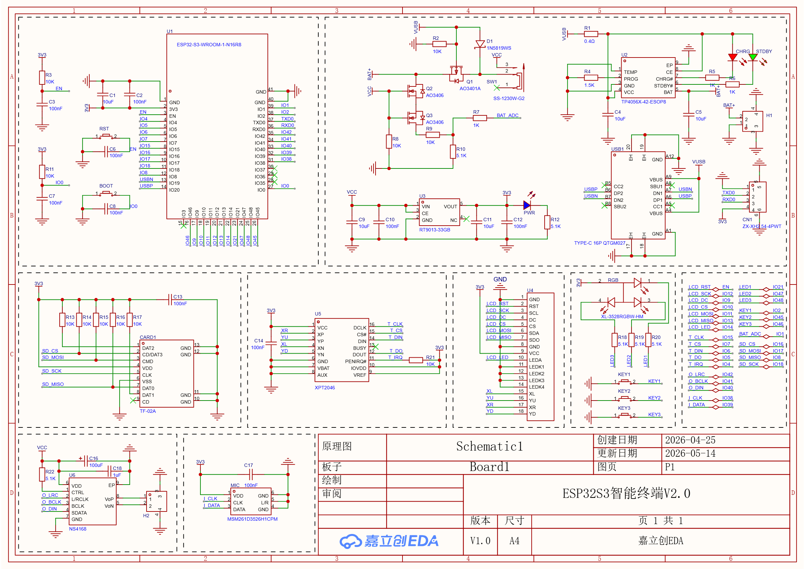

### 5. 打板焊接

**PCB 打板：**

- 板子尺寸 74x43.3mm，可在 **嘉立创** 领取 1~4 层专用券免费打板
- 上传 `hardware/` 目录中的 Gerber 文件
- 选择参数：层数 2 层、板子数量 5、板厚 1.6mm

**元器件采购与焊接：**

- 参考 `hardware/` 目录中的 BOM 表（`.xlsx`）
- BOM 表包含元器件型号、数量和购买链接
- 打开 `hardware/` 目录中的 交互式 BOM（`.html`），可在浏览器中直观查看每个元器件在 PCB 上的焊接位置，大幅提升焊接效率
- 板上元器件都标注了位号，根据 BOM 表焊接

## 🔧 软件配置

### 1. 安装 ESP-IDF

- **下载安装包**：[ESP-IDF 下载页面](https://dl.espressif.com/dl/esp-idf/)，选择 `v5.5.3` 或 `v5.5.4`  版本。

  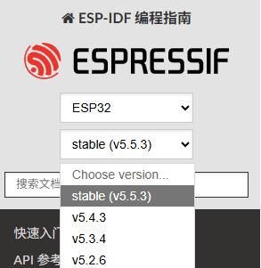

- **安装环境**：

  双击 EXE 开始安装，一直点下一步：

  
  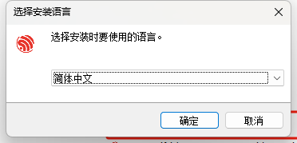
  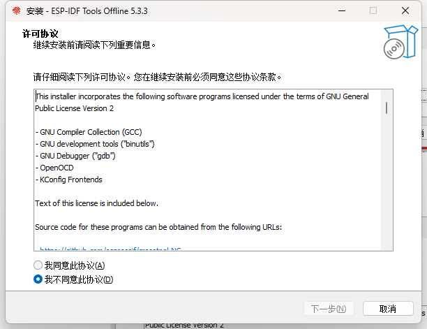

  可在此处修改安装路径：

  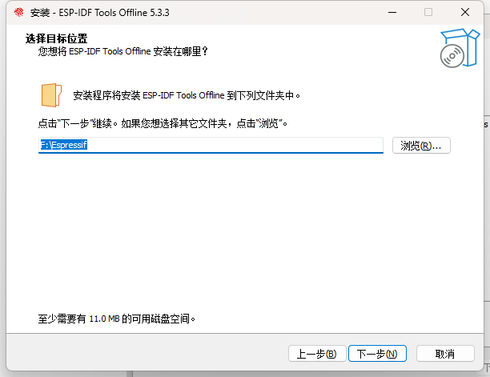

  等待安装完成：

  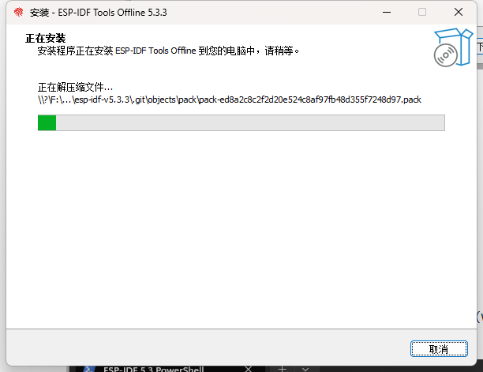

- **测试安装**：

  双击桌面上的 **ESP-IDF PowerShell** 快捷方式，或 `Win + R` 输入 `cmd` 打开终端后点击 **+** 选择 **IDF 环境**：

  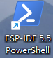
  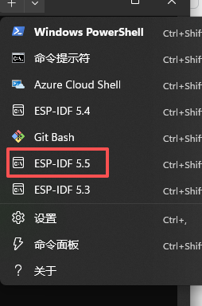

  当出现 `idf.py build` 提示时，说明安装成功：

  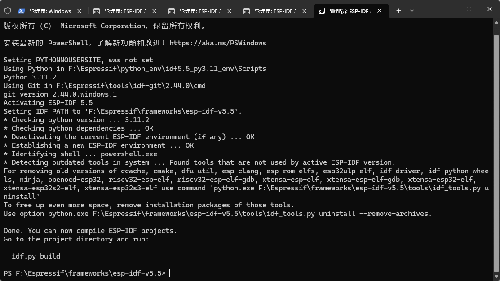

### 2. 克隆项目

在 IDF 终端中运行以下命令：

```powershell
git clone https://github.com/Lee-Stone/esp32s3-lvgl-terminal.idf.git
cd esp32s3-lvgl-terminal.idf
```

### 3. 配置开发环境

设置目标芯片：

```powershell
idf.py set-target esp32s3
```

> 工程已通过 `sdkconfig.defaults` 预配置了 Flash 大小（16MB）、PSRAM（8MB Octal）、LVGL、FATFS 等选项，无需额外执行 `idf.py menuconfig`。

常用 `idf.py` 命令参考：

| 功能 | 命令 | 备注 |
|:-----|:-----|:-----|
| 选择目标芯片 | `idf.py set-target esp32s3` | 仅需执行一次 |
| 编译项目 | `idf.py build` | 生成固件 |
| 烧录固件 | `idf.py -p COMx flash` | `COMx` 替换为实际串口号 |
| 打开串口监视器 | `idf.py -p COMx monitor` | 按 `Ctrl+]` 退出 |
| 编译、烧录并监视 | `idf.py -p COMx flash monitor` | 一键完成 |
| 清除编译输出 | `idf.py clean` / `idf.py fullclean` | 清除中间文件 |

> 更多命令参考：[IDF 前端工具 - idf.py](https://docs.espressif.com/projects/esp-idf/zh_CN/stable/esp32/api-guides/tools/idf-py.html)

### 4. 编译项目

```powershell
idf.py build
```

如果终端输出 `Project build complete`，说明编译成功。

### 5. 烧录程序

使用 USB 转 TypeC 线连接板子上的 TypeC 口，打开开关后运行烧录命令：

```powershell
# 打开设备管理器查看串口号（如 COM5），替换后执行
idf.py -p COM5 flash

# 烧录并打开串口监视器
idf.py -p COM5 flash monitor
```

烧录完成后按 `Ctrl+]` 退出串口监视器。

### 6. 免环境烧录

> 如果不想搭建 ESP-IDF 开发环境，可以使用编译好的固件直接烧录。

**下载烧录工具**：[flash.zip](https://github.com/Lee-Stone/esp32s3-lvgl-terminal.idf/releases/latest/download/flash.zip)

**烧录程序**：

- 解压**烧录工具**，双击文件夹下的 **flash.bat** 文件（若提示有风险，右击以**管理员身份运行**）。

  

- 按下开发板的BOOT按键，再按下RST按键松开，最后松开BOOT按键进入下载模式。

- 选择开发板的串口序号，输入 **y** 确定后开始烧录。

  

  

- 烧录完成之后提示 **Flash Successful**。

  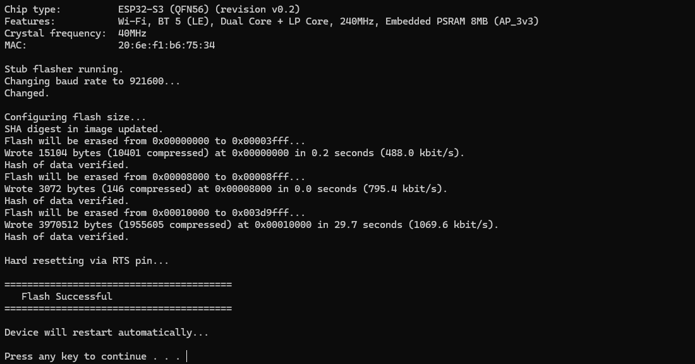

**提示**：烧录工具中包含工程编译出来的 **bin** 文件。

## ⚠️ 注意事项

- **小智 AI 对话**：已集成虾哥开源的满血[小智](https://github.com/78/xiaozhi-esp32)，连接 Wi-Fi 激活设备后即可使用，无需额外配置 API 密钥。

- **SquareLine Studio 工程**：需要下载 [SquareLine Studio V1.5.0](https://static.squareline.io/downloads/SquareLine_Studio_Windows_v1_5_0.zip) 打开 `SquareLine_Project/` 目录。

- **烧录模式**：开发板支持 USB 自动下载，直接烧录即可，无需手动按 BOOT/RST 按键。

- **SD 卡格式要求**：SD 卡推荐使用闪迪，大小无要求，需格式化为 FAT32 文件系统，MP3 文件需放置在根目录才能被识别。

- **魔法网络环境**：首次编译需要下载大量依赖库和工具链，建议开启魔法以加快下载速度。如遇下载慢，可配置国内镜像源。

- **电源供电**：建议使用 5V/2A 以上的电源适配器或质量可靠的 USB 数据线，避免因供电不足导致系统不稳定。

- **串口波特率**：串口通信波特率默认为 115200，使用串口监视器时需保持一致。

- **分区表**：本项目使用自定义分区表 `partitions.csv`，支持 16MB Flash + 双分区 OTA 升级。若使用不同容量的 Flash，请相应修改分区表。

- **sdkconfig**：项目根目录下的 `sdkconfig.defaults` 包含了 LVGL、FATFS、FreeRTOS 等默认配置，首次 `idf.py build` 会自动生成完整的 `sdkconfig`。

- **与 Arduino 版的关系**：本 IDF 版采用 V2.0 硬件，引脚定义与 Arduino 版不同，`hardware/` 和 `SquareLine_Project/` 不可直接互换使用。

## 📧 联系方式

- 🐧：2103539430
- 🛰：Ubuntu_Noble
